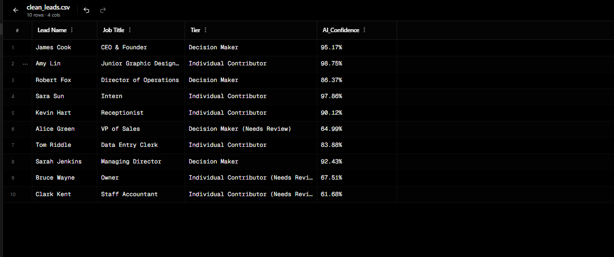

# 🤖 AI Lead Bulk Processor

## 📌 Overview
This tool processes large lists of leads and automatically organizes them based on importance using AI.

It helps businesses quickly identify decision-makers and separate low-quality or uncertain leads.

---

## 💼 What It Does

- Processes bulk lead data (names + job titles)
- Classifies leads into:
  - Decision Makers
  - Individual Contributors
- Adds AI confidence score for each lead
- Flags uncertain results for manual review
- Separates high-value leads automatically
- Exports clean CSV files

---

## 💼 Why This Matters

Businesses often have large, messy lead lists but don’t know who to contact first.

This system:
- prioritizes important contacts  
- removes guesswork  
- saves hours of manual sorting  

---

## 📊 Sample Output

---

## 📁 Output Files

- `clean_leads.csv` → full processed data  
- `urgent_leads.csv` → high-value leads  
- `manual_review.csv` → uncertain leads needing review  

---

## ⚙️ How to Run
install panndas  
install transformer library

1. Install dependencies:
