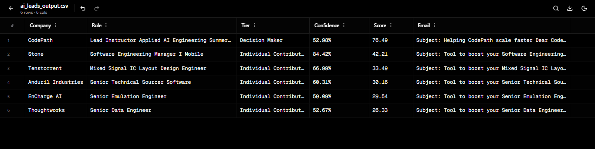

# 🚀 AI Sales Automation System

## 📌 Overview
This project automates the process of finding and prioritizing potential customers using AI.

It collects business leads, identifies decision-makers, ranks them by importance, and generates personalized outreach emails.

---

## 💼 What It Does

- Fetches job/company data using API
- Filters relevant leads (tech roles)
- Identifies decision-makers using AI
- Scores leads based on importance
- Generates ready-to-send email drafts
- Exports results into a clean CSV file

---

## 💼 Why This Matters

Businesses spend hours manually searching for leads and deciding who to contact.

This system automates that process and helps focus on high-value opportunities, saving time and effort.

---

## 📊 Sample Output

---

## 📁 Output File

- `ai_leads_output.csv` → contains:
  - Company
  - Role
  - Tier (Decision Maker / Contributor)
  - Score
  - Email Draft

---

## ⚙️ How to Run

1. Install dependencies:
