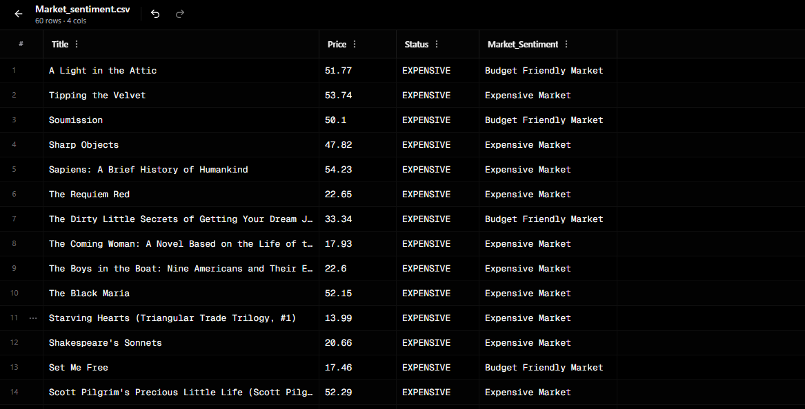

## 📌 Overview
Extracts useful data from websites and converts it into structured formats like CSV or Excel.

## 💼 What It Does
- Collects data such as product details, prices, or listings
- Cleans and organizes messy website data
- Saves results into easy-to-use files (CSV/Excel)

## 💼 Why This Matters
Companies need data for research, pricing, and decision-making.  
This tool automates data collection and removes the need for manual copy-pasting.
## 📸 Sample Output

